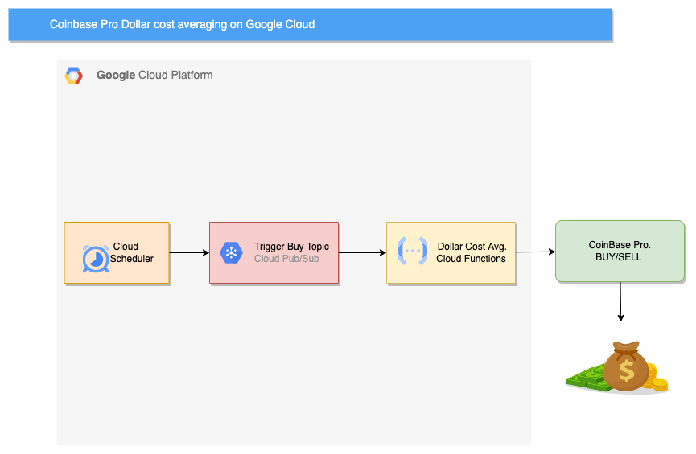

# Deploy automated recurring buys on Google Cloud Platform

## Disclaimer
_Since our use case is lightweight, the gcp's resource requirements fall fairly within gcp's *free quota limit*.

Inshort these resources should be free of charge for our usecase. <Br>
Having said that, I suggest people should do their our research regarding the gcp charges.
_

## System Architecture


## Initial account set up
* Create up a [google cloud platform account](https://cloud.google.com/gcp?utm_source=google&utm_medium=cpc&utm_campaign=na-US-all-en-dr-bkws-all-all-trial-e-dr-1011347&utm_content=text-ad-none-any-DEV_c-CRE_491349594127-ADGP_Desk%20%7C%20BKWS%20-%20EXA%20%7C%20Txt%20~%20Google%20Cloud%20Platform%20Core-KWID_43700064423315751-kwd-26415313501&utm_term=KW_google%20cloud%20platform-ST_google%20cloud%20platform&gclid=EAIaIQobChMIg_rckMzm9wIVAMqUCR0y6QNHEAAYASAAEgKRG_D_BwE&gclsrc=aw.ds) & add [billing information](https://console.cloud.google.com/billing?authuser=1&supportedpurview=project) to access set of services.
* We will be using three main services from GCP (Make sure you enable them for your GCP account)
  * [Cloud Functions](https://cloud.google.com/functions)
  * [Cloud pubsub](https://cloud.google.com/pubsub)
  * [Cloud Scheduler](https://cloud.google.com/scheduler)


## Tutorial
### Schedule a recurring BTC-USD buy for $2 USD every hour

A Cloud scheduler instance will trigger the pub/sub topic that will inturn trigger the cloud function which will buy BTC for us.

1. Copy the example config file to `settings-local.conf` (`settings-local.conf` is already added to `.gitignore`) and update the file with correct values

	```bash
	cp settings.conf.example settings-local.conf
	```
2. Install python dependencies
   ```bash
   pip install -r requirements.txt
3. Make sure that the dependencies are installed and config values are noted correctly.<Br>
Run a `$1` buy to make sure.
   ```bash
   python gdax_bot.py BTC-USD BUY 1.00 USD -c settings-local.conf -j
   ```
4. Now we are ready to deploy the code to GCP

   *
